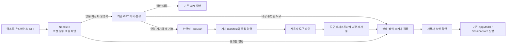

# Adaptive Space MVP

Android XR을 제외한 최소 수직 슬라이스입니다.

```text
더미 웨어러블 연결·동기화
→ GPT-5.6 Luna 신호 추세 해석 + 결정론적 환경 프로필
→ 집 시뮬레이터 적용·보정·복원
→ 호텔 데모 QR 체크인
→ 동반자 허용 범위 교집합·명시적 합의
→ 생체정보 없는 공간 변환·적용
→ 체크아웃·기본값 복원·세션 만료
```

## 구성

- `iOS/AdaptiveSpace`: iOS 17+ SwiftUI 앱
- `server`: Python OpenAI Agents SDK 서버
- `project.yml`: XcodeGen 원본 (`.xcodeproj`는 생성물)
- `mise.toml`: 런타임 버전과 공통 실행 명령
- `Brewfile`: 시스템 패키지 선언

에이전트는 동의된 최근 더미 신호 창을 분석 도구로 요약하고, 변화 추세를 바탕으로 회복·집중·휴식 맥락과 근거를 결정합니다. 조명·온도·사운드 실행값, 공간 범위 제한, 승인, 복원과 만료는 서버의 결정론적 정책이 담당합니다.

짧은 공간 명령은 Needle 2가 먼저 온디바이스에서 함수 호출 **제안**으로 분류합니다. 신뢰도 0.80 미만, 빈 호출, 잘못된 스키마, UTF-8/엔진 오류는 실행하지 않고 서버 GPT 대화로 넘깁니다. GPT가 내장 명령 또는 이미 승인된 도구를 찾으면 다시 제안 카드로 돌아오며, 어느 경로에서도 사용자가 확인하기 전에는 상태가 바뀌지 않습니다. 현재 공식 iOS 정적 라이브러리의 최소 OS가 26.5이므로 iOS 17~26.4에서는 네이티브 호출을 건너뛰고 같은 서버 폴백을 사용합니다. 정적 라이브러리에 모델 가중치가 이미 포함되어 있어 별도 `.cact` 사본은 앱에 번들하지 않습니다.



GPT가 만드는 것은 임의 Swift/Python 코드가 아닙니다. 현재 연결된 기기가 미리 광고한 `device_id`와 `capability_id`, 제한된 scalar JSON Schema를 조합한 선언형 `ToolDraft`뿐입니다. 서버가 스키마를 다시 검증하고 사용자가 승인한 뒤에만 안정적인 도구 ID로 저장됩니다. 매번 실행 인자를 원래 기기 범위와 다시 비교하며, 현재 구현의 새 기기 어댑터는 결정론적 시뮬레이터입니다.

상단 대화 버튼에서는 현재 추천의 맥락과 최종 환경값을 Agent에게 텍스트 또는 음성으로 질문할 수 있습니다. 보이스 모드는 한국어 온디바이스 STT → 기존 Agent → iOS 한국어 시스템 TTS의 chained 방식입니다. STT 요청은 `requiresOnDeviceRecognition`을 강제하며, 해당 기기가 한국어 온디바이스 인식을 지원하지 않으면 네트워크 음성 인식으로 폴백하지 않고 텍스트 입력을 안내합니다. 원본 음성은 저장하거나 서버로 전송하지 않지만, Needle이 처리하지 못해 GPT로 넘어가는 경우에는 인식된 텍스트가 기존 Agent 서버로 전송될 수 있습니다. 원본 생체 스트림과 동반자 허용 범위는 대화 요청에 포함하지 않습니다.

호텔 체크인 뒤에는 두 사용자의 밝기·온도 허용 범위를 iOS에서만 교차 계산합니다. 교집합이 있으면 기존 추천을 그 범위 안으로 제한하고, 없으면 자동 적용하지 않습니다. 명시적 승인 뒤 최종 환경 프로필만 호텔 세션으로 전송하며 개인별 범위와 생체정보는 전송하지 않습니다.

이 하이브리드 구조는 규칙만 사용했을 때의 경직성과 확률 모델만 사용했을 때의 비결정성을 분리합니다. 확률 모델은 복합 신호의 맥락을 해석하고, 결정론적 모델은 같은 승인 입력에 항상 같은 범위 내 실행값을 보장합니다. 경쟁력은 주장으로 확정하지 않고 규칙 단독 기준선과의 비교 평가로 검증합니다.

UI는 iOS 26 이상에서 SwiftUI 네이티브 Liquid Glass(`glassEffect`, `GlassEffectContainer`, glass 버튼 스타일)를 사용합니다. iOS 17~25에서는 동일한 정보 구조와 동작을 유지하는 system material 폴백을 사용합니다.

UI 작업에 사용한 `swiftui-liquid-glass`, `mobile-app-ui-design` 스킬은 `.agents/skills`에 프로젝트 전용으로 설치되어 있으며 `skills-lock.json`으로 버전을 추적합니다.

## 실행

최초 한 번:

```bash
mise run setup
```

터미널 1에서 서버 실행:

```bash
mise run server
```

터미널 2에서 Xcode 프로젝트를 생성하고 엽니다:

```bash
mise run ios:generate
open AdaptiveSpace.xcodeproj
```

Xcode에서 `AdaptiveSpace` 스킴과 iPhone Simulator를 선택해 실행합니다. 서버 주소 기본값은 `http://127.0.0.1:8000`입니다.

### 새 기기 기능을 도구로 만들고 재사용하기

새 기기는 먼저 자신의 허용 기능을 manifest로 등록한 뒤 명시적으로 연결합니다. 예를 들어 공기청정기 모드만 허용하려면:

```bash
curl -sS http://127.0.0.1:8000/v1/devices \
  -H 'Content-Type: application/json' \
  -d '{
    "device_id":"bedroom-air-purifier",
    "name":"침실 공기청정기",
    "adapter":"simulator",
    "scopes":["home"],
    "connected":false,
    "capabilities":[{
      "capability_id":"set_mode",
      "name":"운전 모드 설정",
      "description":"공기청정기 운전 모드를 설정합니다.",
      "parameters":{
        "type":"object",
        "properties":{"mode":{"type":"string","enum":["sleep","auto","boost"]}},
        "required":["mode"],
        "additionalProperties":false
      }
    }]
  }'

curl -sS http://127.0.0.1:8000/v1/devices/bedroom-air-purifier/connect \
  -H 'Content-Type: application/json' \
  -d '{"connected":true}'
```

이후 Agent 탭에서 “공기청정기를 수면 모드로 바꿔줘”라고 요청하면 먼저 **도구 만들기** 카드가 표시됩니다. 이 확인은 도구만 레지스트리에 저장하며 기기를 움직이지 않습니다. 이어서 표시되는 **실행** 카드를 다시 확인해야 첫 실행이 시뮬레이터에 반영됩니다. 같은 기능의 다음 요청부터는 저장된 도구를 Needle 또는 GPT가 재사용하고, 실제 실행은 매번 다시 확인합니다. 로컬 상태는 `server/data/tool_registry.json`에 원자적으로 저장되며 Git에는 포함되지 않습니다.

API에서도 순서는 같습니다.

1. `POST /v1/commands/route`로 새 기능의 `tool_draft`와 `proposal_id`를 받습니다.
2. `POST /v1/tool-drafts/{draft_id}/approve`에 `{"proposal_id":"..."}`를 보내 도구만 저장합니다.
3. 승인 응답의 `execution_proposal.proposal_id`를 `POST /v1/command-proposals/{proposal_id}/confirm`에 빈 JSON 객체 `{}`로 확인해 실행합니다.
4. 이후 요청은 `dynamic_proposal`로 재사용되며 같은 confirm endpoint에서 실행합니다.

서버는 검증된 인자·기기·기능·공간 범위를 120초짜리 1회용 proposal에 묶습니다. 확인 요청은 인자를 다시 받지 않으므로 UI에서 확인한 값과 실제 실행값을 바꿀 수 없습니다. 다중 공간 기기도 현재 요청한 공간 하나에만 도구가 승인되며, 다른 공간에서 재사용하려면 별도 승인이 필요합니다. 로컬 Needle 제안도 `POST /v1/builtin-tools/{name}/proposals` 또는 `POST /v1/tools/{id}/proposals`에서 동일한 서버 proposal로 승격한 뒤에만 확인 카드로 표시합니다. 관련 조회·연결 API는 `GET/POST /v1/devices`, `POST /v1/devices/{id}/connect`, `GET /v1/tools`입니다.

호텔 `SessionStore` 명령은 proposal에 `session_id`까지 묶습니다. 확인 시 `POST /v1/sessions/{session_id}/commands`에 `{"proposal_id":"..."}`만 보내며, 예전처럼 `{"action":"apply"}`를 직접 보내는 경로는 거부됩니다. 서버는 저장된 내장 명령만 `apply`, `stop`, `restore`, `checkout`으로 매핑해 해당 세션에 한 번 실행합니다.

## 검증

```bash
mise run check
mise run server:test
mise run server:eval
mise run ios:build
mise run ios:test
```

서버를 실행한 상태에서 전체 시뮬레이터 흐름을 검증합니다:

```bash
mise run ios:test-ui
```

## 이번 범위에서 제외

HealthKit·Apple Watch·BLE, 실제 건강정보, 실제 IoT 어댑터, 카메라 QR, 로그인·DB·다중 사용자, 호텔 PMS·결제, Android XR은 구현하지 않았습니다. 더미 웨어러블, 방 시뮬레이터, 선언형 기기 manifest 계약을 유지한 채 후속 어댑터로 교체할 수 있습니다.
